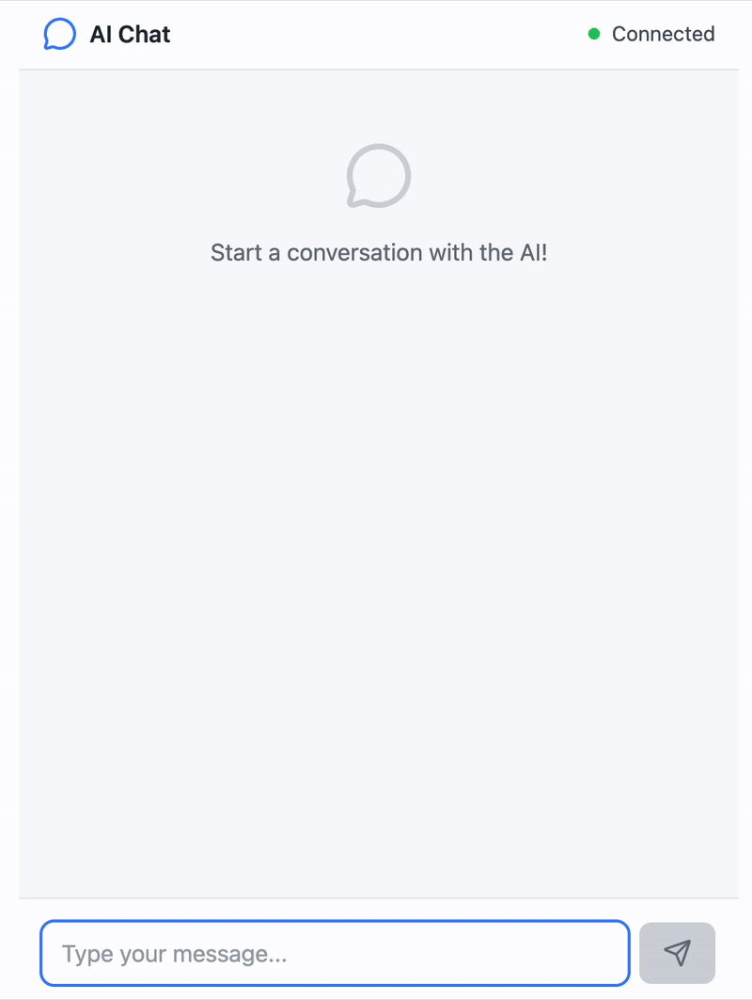

# Streaming AI Chatbot

This is a demo based on a motia example: https://github.com/MotiaDev/motia-examples/tree/main/examples/streaming-ai-chatbot

## Features
- Real-time streaming AI responses (motia streams)
- Conversation context management (motia state + events)

## Demo



## Usage
 - run the backend:
 - ```bash
   npm run dev:backend
    ```
 - run the frontend:
 - ```bash
   npm run dev:frontend
   ```
